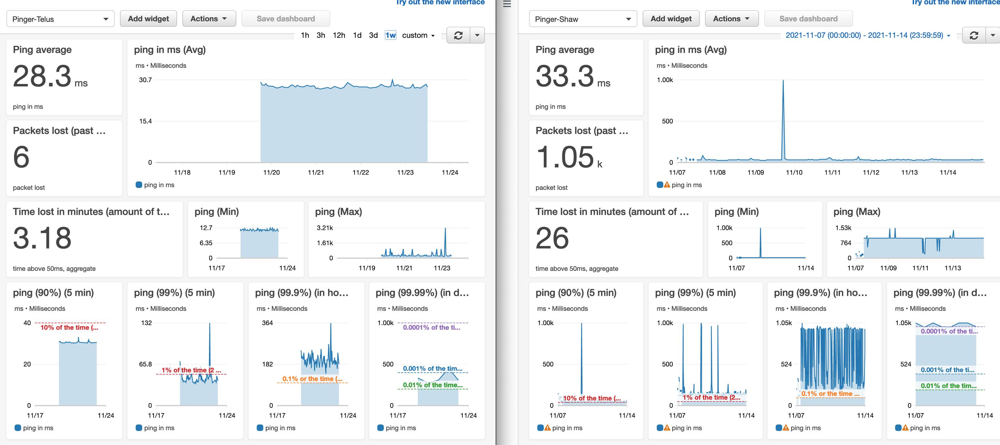

# Pinger

A python tool to test what route is slow.

The `ping.sh` file invokes the `ping.py` and allows successive runs to kill the old process.

## For a simple output in ms

Just run:

```
./shell-ping/ping.sh
```

## To send data to CloudWatch and automatically monitor your system

_(Note this is only tested with a Mac system for now...)_

- Create an AWS account, or log in to one.
- Create a virtualenv with python3 and load it.
- Install awscli and boto3: `pip install -r requirements.txt`
- Configure your aws cli so you are authenticated to publish to your account: `aws configure` Reference: https://docs.aws.amazon.com/cli/latest/userguide/cli-chap-configure.html
- Create a log group, and a log stream here: https://us-west-2.console.aws.amazon.com/cloudwatch/home?region=us-west-2#logsV2:log-groups
  - TODO: make this automated with the aws cli and aws-cdk or cloudformation template
- Make sure those names are used in the ping.py script
- Run `./ping.py` to make sure it works and there are no errors.
- Check the log stream to make sure it is populating correctly
- In CloudWatch > Log groups > select your log group.
- Click "Metric filters" and add a filter with the Filter Pattern `[time]` and Next > Metric value is set to `$time`
- In CloudWatch > Dashboards, create a dashboard, and create a line graph based on this metric.

## To enable it at startup

(Still in progress, the plist file doesn't seem to invoke, PLEASE HELP)

- Run your virtualenv python in the hashbang:
-   Run `which python` while in your virtualenv
-   Update the first line in `ping.py` to it so it looks like something like:

```
#!/Users/marioviens/coding/projects/pinger/.venv/bin/python
```

- Copy the .plist file to your launch daemons folder and replace <path> with the path to your pinger.py executable. On a Mac the loanch daemon folder is: `/Library/LaunchDaemons/`
- Add the file to the launchctl registry `launchctl load -w /Library/LaunchDaemons/pinger.plist`
- (Still trying to figure out) enable this and confirm it runs successfully on system start... `sudo launchctl enable system/com.pinger.tendermario`

## To run on terminal window launch

This is a workaround to the above for now: when you open terminal, it runs this shell script and puts
it in the background. You can close the terminal and theoretically the process should be running in the background.

- Add running the `ping.sh` in your dotfile:

```
 . ~/coding/projects/pinger/.venv/bin/activate
 cd ~/coding/projects/pinger
 ./ping.sh
 cd -
 deactivate
```


## TODO:

### Check each step of the hop

We currently use `ping google.ca -c1` to test all the way to google. Instead, we could use `traceroute -q 1 google.ca` to test each hop, e.g.:

```
➜  pinger git:(master) traceroute -q 1 google.ca;
traceroute to google.ca (142.251.33.99), 64 hops max, 52 byte packets
 1  hitronhub.home (192.168.0.1)  3.300 ms
 2  70.66.160.1 (70.66.160.1)  11.541 ms
 3  rd2bb-be106-1.no.shawcable.net (64.59.161.213)  12.273 ms
 4  rc1wt-be40.wa.shawcable.net (66.163.68.18)  31.698 ms
 5  72.14.221.102 (72.14.221.102)  23.980 ms
 6  74.125.243.193 (74.125.243.193)  47.029 ms
 7  142.251.50.177 (142.251.50.177)  31.671 ms
 8  sea30s10-in-f3.1e100.net (142.251.33.99)  27.357 ms
 ```

 Gives more details on every single step. We could see what's the weakest link (I'm looking at you Shaw), and isolate it to be the last mile (step 2), your connection to your route (step 1), the internet highway (steps 3-7 or so), or the endpoint (step 8 or so).

### Handle bad packets better

`2021-11-05T22:38:20.695-07:00	NG www.google.ca (142.250.217.99): 56 data bytes\n\n--- www.google.ca ping statistics ---\n1 packets transmitted, 0 packets received, 100.0% packet loss\n`

I'm currently using a metric filter to catch these for now and treat it as a full disconnect for that second.

I could alternatively send this data directly from the ping command like "1000" or "timeout".

## Example



MIT License.
