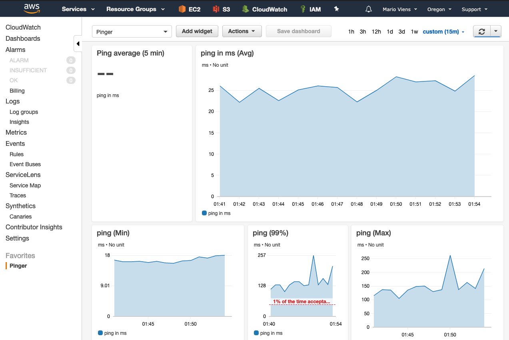

# Pinger

A tool to test what route is slow.

## For a simple ms output

Just run:

```
./shell-ping/pinger.sh
```

## To send data to CloudWatch and automatically monitor your system

_(Note this is only tested with a Mac system for now...)_

- Create an AWS account, or log in to one.
- Create a virtualenv with python3 and load it.
- Install awscli and boto3: `pip install -r requirments.txt`
- Configure your aws cli: `aws configure` Reference: https://docs.aws.amazon.com/cli/latest/userguide/cli-chap-configure.html
- Create a log group, and a log stream here: https://us-west-2.console.aws.amazon.com/cloudwatch/home?region=us-west-2#logsV2:log-groups
-   TODO: make this automated with the aws cli
- Make sure those names are used in the ping.py script
- Run `./ping.py` to make sure it works and there are no errors.
- Check the log stream to make sure it is populating correctly
- In CloudWatch > Log groups > select your log group.
- Click "Metric filters" and add a filter with the Filter Pattern `[time]` and Next > Metric value is set to `$time`
- In CloudWatch > Dashboards, create a dashboard, and create a line graph based on this metric.

## To enable it at startup

- Run your virtualenv python in the hashbang:
-   Run `which python` while in your virtualenv
-   Update the first line in `ping.py` to it so it looks like something like:

    ```
     #!/Users/marioviens/coding/projects/pinger/.venv/bin/python
    ```

- Copy the .plist file to your launch daemons folder and replace <path> with the path to your pinger.py executable. On a Mac the loanch daemon folder is: `/Library/LaunchDaemons/`
- Add the file to the launchctl registry `launchctl load -w /Library/LaunchDaemons/pinger.plist`
- (Still trying to figure out) enable this and confirm it runs successfully on system start... `sudo launchctl enable system/com.pinger.tendermario`
    
    
## Example




MIT License.
